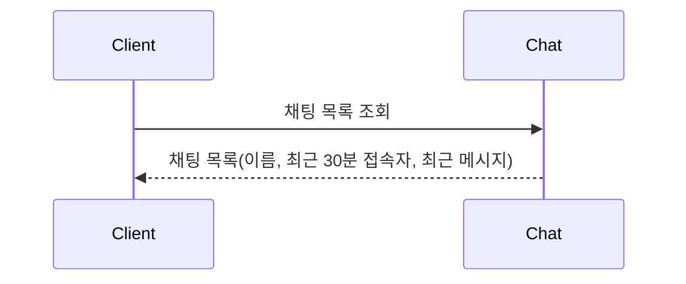
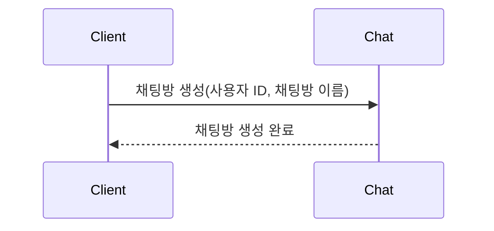
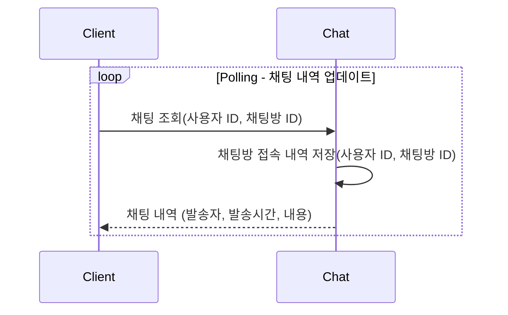
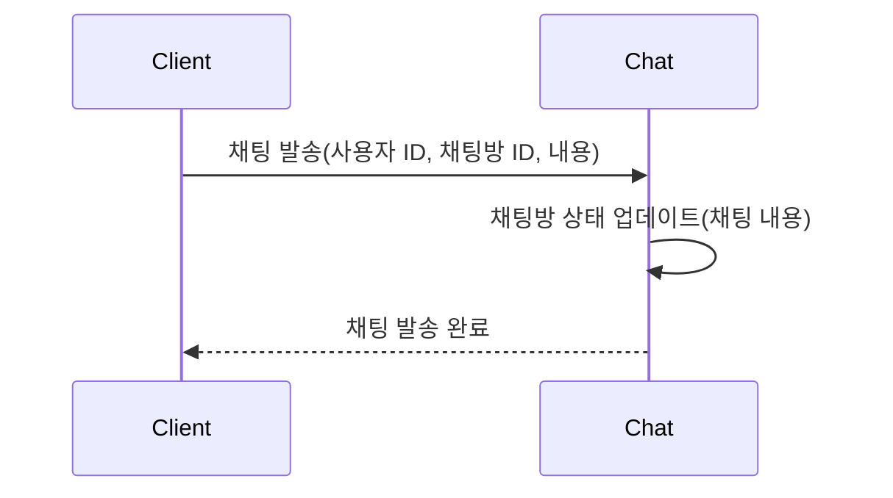
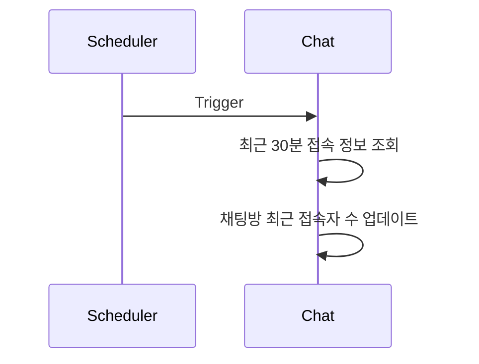
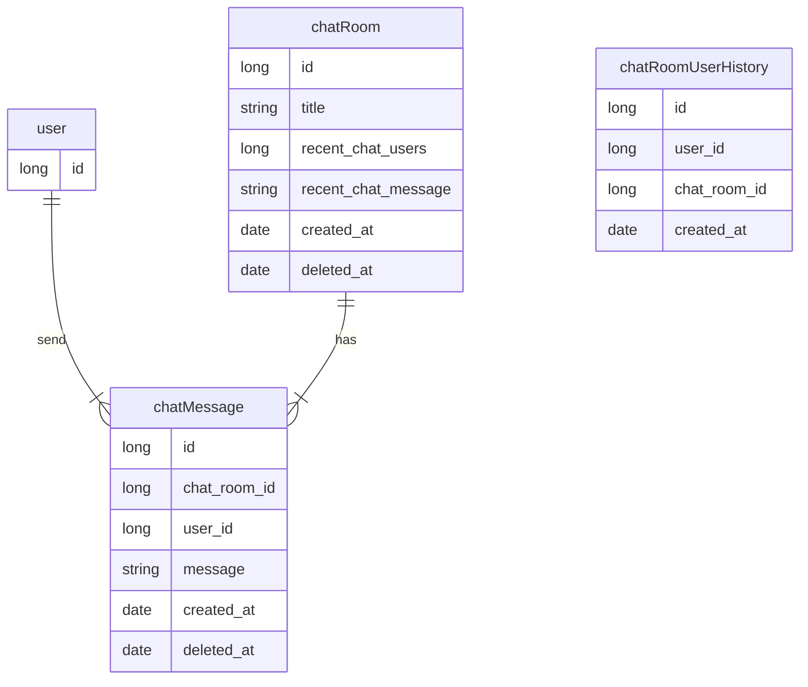

# Chat Application
## 🛠️ Environment
- Java 17
- Spring Boot 3.3
- H2 Database (in-memory)
- Redis

## 📖 Getting Started
> #### Prerequisites
> - Docker
> 
### Run with Docker
```shell
docker compose up -d
```
### API Document 접속
- http://localhost:8080/swagger-ui.html

## 요구 사항 분석
### 채팅방 조회

### 채팅방 생성

### 채팅 조회 (Polling)

### 채팅 발송

### 채팅방 최근 사용자 정보 Scheduling

## ERD
