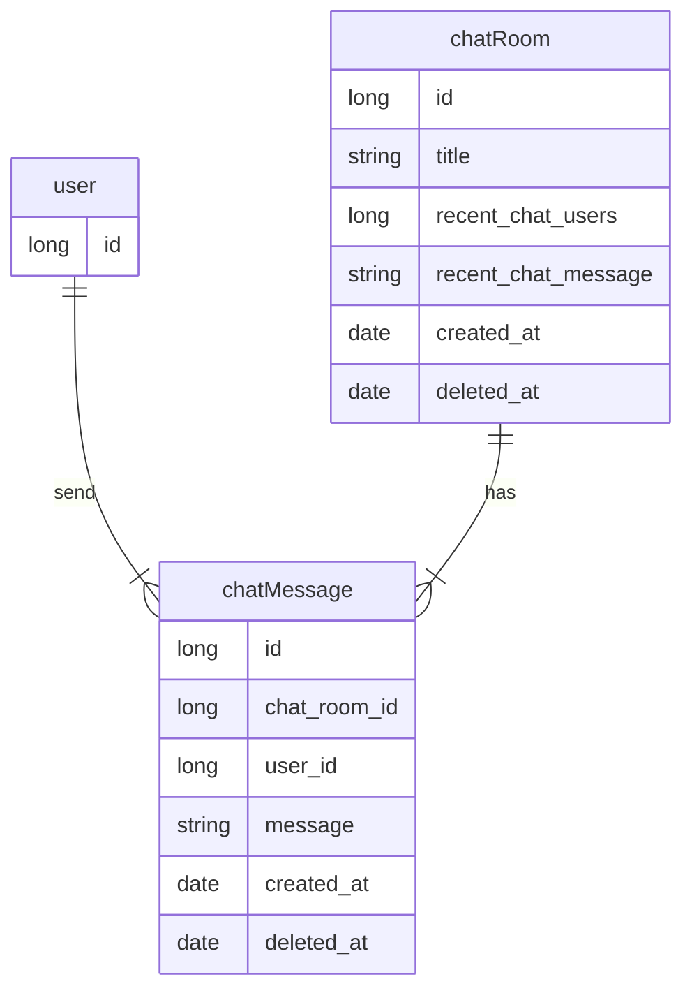

# Chat Application
## 🛠️ Environment
- Java 17
- Spring Boot 3.3
- H2 Database (in-memory)
- Redis

## 📖 Getting Started
> #### Prerequisites
> - Docker
> 
### Run with Docker
```shell
docker compose up -d
```

## 요구 사항 분석
### 채팅방 조회

```mermaid
sequenceDiagram
    Client ->> Chat: 채팅 목록 조회
    Chat -->> Client: 채팅 목록(이름, 최근 30분 접속자, 최근 메시지)
```

### 채팅방 생성

```mermaid
sequenceDiagram
    Client ->> Chat: 채팅방 생성(사용자 ID, 채팅방 이름)
    Chat -->> Client: 채팅방 생성 완료
```

### 채팅 조회 (Polling)

```mermaid
sequenceDiagram
    loop Polling - 채팅 내역 업데이트
        Client ->> Chat: 채팅 조회(사용자 ID, 채팅방 ID)
        Chat -->> Client: 채팅 내역 (발송자, 발송시간, 내용)
    end
```

### 채팅 발송

```mermaid
sequenceDiagram
    Client ->> Chat: 채팅 발송(사용자 ID, 채팅방 ID, 내용)
    Chat -->> Client: 채팅 발송 완료
```

## ERD
